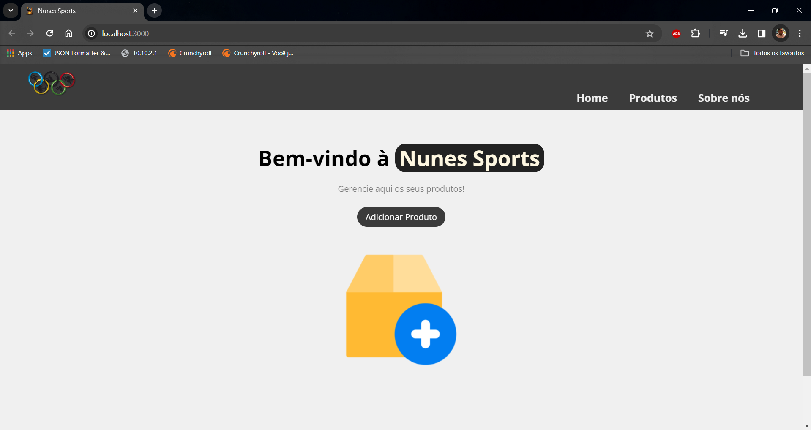

# WallJobs - Teste de Desenvolvimento para Nunes Sports

## Descrição
O projeto WallJobs é um teste prático desenvolvido para a empresa fictícia Nunes Sports. O objetivo é criar um sistema web com operações CRUD, onde foi utilizado Java para o backend e Javascript com ReactJS para o frontend. A aplicação interage com um banco de dados H2 para armazenar informações sobre produtos.

## Tecnologias Utilizadas
- Java
- Spring Boot (Spring Web e Spring Data JPA)
- H2 Database
- JUnit & Mockito
- Javascript
- ReactJS (React Router, React Icons, React, Material Icons, React Hooks, React Loader e Modal)

# Layout e Design

## Imagem do backend que precisa ser ativado antes

## Página Home

## Página com a lista de produtos

## Imagem da página com a história da Companhia

## Estrutura do Projeto
O projeto é dividido em camadas, seguindo as boas práticas de desenvolvimento:

- **Entity:** Contém as classes que representam os objetos do domínio (Product).
- **Repository:** Responsável por realizar as operações de persistência no banco de dados.
- **Service:** Implementa a lógica de negócios e orquestra as operações entre o Controller e o Repository.
- **Controller:** Recebe as requisições do frontend e chama os métodos apropriados no Service.

## Funcionalidades
- **Página Home:** Apresenta uma tela de boas-vindas juntamente com um botão para fazer a adição de novos pdutos e começar o gerenciamento.
- **Página de Produtos:** Lista todos os produtos cadastrados, permitindo a edição e exclusão de cada item.
- **Página de Adição de Produtos:** Permite a inclusão de novos produtos na base de dados.

## Como Executar
1. Clone o repositório.
2. Configure o ambiente de desenvolvimento para Java 17 e ReactJS v6 ou superior.
3. Execute o backend através da IDE Spring Tool Suite (ambiente onde foi desenvolvido), Eclipse ou alguma outra de sua preferência.
   - Caso queira fazer uma verificação na base de dados do H2, lembre-se de acessar o localhost:8080/h2-console e inserir os dados de login conforme está no arquivo application.properties. Por via das dúvidas deixei o username e password que vem preenchido por padrão no H2 que são: Username: sa, Password: (nulo, apenas um campo em branco).
5. Execute o frontend usando o VS Code (ambiente onde foi desenvolvido) ou outra IDE de sua preferência. 
  - *Não se esqueça de executar o comando 'npm install' dentro da raiz do frontend para adicionar as bibliotecas corretas em suas devidas versões.*

    - npm install
    - npm start

## Contribuições
Contribuições são bem-vindas! Se encontrar problemas ou tiver sugestões, sinta-se à vontade para abrir uma issue ou enviar um pull request.

